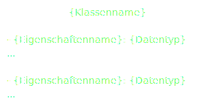
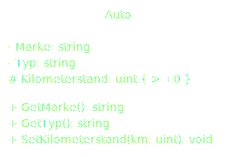

# Klassendiagramm
- [Zugriffsmodifizierer](#zugriffsmodifizierer)
    - [Public](#public)
    - [Protected](#protected)
    - [Private](#private)
    - [Package](#package)
- [Beziehungen](#beziehungen)
    - [Assoziation](#assoziation)
    - [Gerichtete Assoziation](#gerichtete-assoziation)
    - [Vererbung](#vererbung)
    - [Aggregation](#aggregation)
    - [Komposition](#komposition)
- [Aufbau](#aufbau)
- [Beispiel](#beispiel)
    - [Diagramm](#diagramm)
    - [C# Code](#c-code)
- [Kardinalitäten](#kardinalitäten)

### Public
`+` Unbeschränkter Zugriff

### Protected
`#` Zugriff nur von der Klasse sowie von Unterklassen (erbende Klassen)

### Private
`-` Nur die Klasse selbst kann es sehen

### Package
`~` Innerhalb des Pakets sichtbar (nur in wenigen Programmiersprachen, etwa Java und C#, implementierbar)

## Beziehungen

### Assoziation
Beziehung zwischen Instanzen der beteiligten Klassen.


### Gerichtete Assoziation
Gibt an, dass eine Klasse von einer anderen abhängt, typischerweise bei der Nutzung von Methoden oder Resourcen. Es ist eine schwächere Form der Beziehung, die andeutet, dass eine Änderung in der `"Lieferanten"-Klasse die "Klienten"-Klasse` beeinflussen könnte.


### Vererbung
`"Ist-ein-Typ-von"-Beziehung`, abgeleitet von einer Basis-Klasse.


### Aggregation
`"Ganzes-zu-Teil"-Beziehung`, die anzeigt, dass eine Klasse (die mit dem Diamanten verbundene) eine Sammlung oder einen besitzenden Einfluss auf die anderen Klassen hat, aber es besteht eine schwache Beziehung; Objekte haben unabhängige Lebenszyklen (Z. B.: `Ein Baum (Ganzes) hat Blätter (Teile), aber die Blätter können unabhängig existieren`).


### Komposition
Stärkere `"Ganzes-zu-Teil"-Beziehung`, die Lebenszyklen der `"Teil"-Objekte` hängen vom `Ganzen` ab. Wenn das `Ganze` zerstört wird, werden auch die `Teile` zerstört (Z. B.: `Ein Auto (Ganzes) und sein Motor (Teil) - wenn das Auto zerstört wird, wird auch der Motor zerstört`).


## Aufbau


## Beispiel
### Diagramm


### C# Code
```cs
public class Auto
{
    private string Marke;
    private string Typ;
    protected uint Kilometerstand;

    public string GetMarke()
    {
        return Marke;
    }

    public string GetTyp()
    {
        return Typ;
    }

    public void SetKilometerstand(uint km)
    {
        if (km > Kilometerstand)
            Kilometerstand = km;
    }
}
```

## Kardinalitäten
|Identität|Erklärung
|-   |-
|1   |Ein Element muss vorhanden sein.
|0..1|Ein oder kein Element darf vorhanden sein.
|0..*|Keine oder mehr Elemente dürfen vorhanden sein.
|1..*|Mindestens ein oder mehr Elemente müssen vorhanden sein.

&uarr; [Zurück nach oben](#top)


