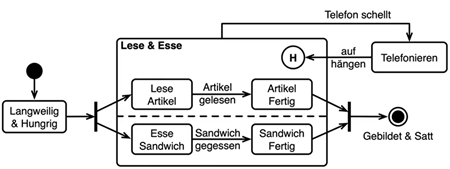
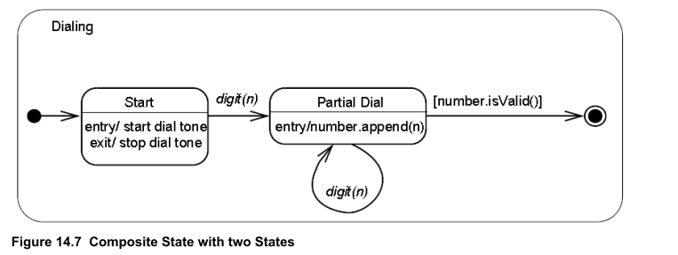
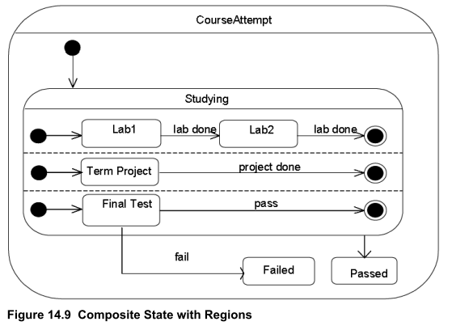
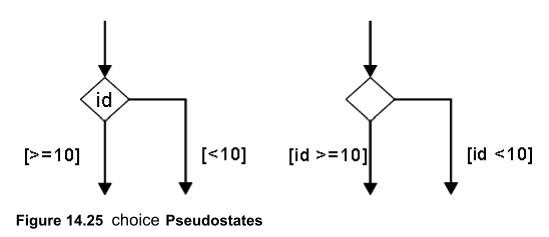

# Zustandsdiagramm
- [Pseudoustände](#pseudozustände)
    - [Startzustand](#startzustand)
    - [Endzustand](#endzustand)
    - [Terminator](#terminator)
    - [Kreuzung](#kreuzung)
    - [Entscheidung](#entscheidung)
- [Verschachtelung](#verschachtelung)
    - [Flache Historie](#flache-historie)
    - [Tiefe Historie](#tiefe-historie)
- [Zustandsregionen](#zustandsregionen)
    - [Gabelung](#gabelung)
    - [Verinigung](#vereinigung)
- [Beispieldiagramme](#beispieldiagramme)

## Pseudozustände

### **Startzustand**
Jedes Zustandsdiagramm weist einen **Startzustand**. Er besitzt keine eingehenden Transitionen und nur genau eine ausgehende Transition, die angibt, in welchem Zustand begonnen wird. Der Startzustand selbst kann nicht eingenommen werden. Neu erzeugte Objekte befinden sich immer in dem auf den Startzustand folgenden Zustand.

### **Endzustand**
Besitzt keine ausgehenden Transitionen. Das Objekt bzw. die Ebene hat den Endzustand erreicht (Objekt kann ewig im Endzustand existieren).

### **Terminator**
Beendet sofort die Ausführung der gesamten Zustandsmaschine, um abrupte Abbrüche zu erzwingen, z. B. im Falle eines Fehlers.

<svg width="100" height="100">
    <line x1="0" y1="0" x2="100" y2="100" stroke="#000" stroke-width="3" />
    <line x1="100" y1="0" x2="0" y2="100" stroke="#000" stroke-width="3" />
</svg>

### **Kreuzung**
Werden verwendet, um mehrere Transitionen zu verbinden. Der Kontrollfluss wird nicht aufgeteilt.

<svg width="400" height="300">
    <defs>
        <!-- A marker to be used as an arrowhead -->
        <marker id="arrow"
            viewBox="0 0 10 10"
            refX="5" refY="5"
            markerWidth="6" markerHeight="6"
            orient="auto-start-reverse">
            <path d="M 0 0 L 10 5 L 0 10 z" />
        </marker>
    </defs>
    <!-- Zeigende Pfeile -->
    <circle cx="200" cy="150" r="50" fill="#000" />
    <line x1="10" y1="10" x2="145" y2="115" stroke="#000" stroke-width="5" marker-end="url(#arrow)" />
    <line x1="10" y1="290" x2="145" y2="185" stroke="#000" stroke-width="5" marker-end="url(#arrow)" />
    <!-- Entfernende Pfeile -->
    <line x1="245" y1="145" x2="380" y2="50" stroke="#000" stroke-width="5" marker-end="url(#arrow)" />
    <line x1="250" y1="150" x2="380" y2="150" stroke="#000" stroke-width="5" marker-end="url(#arrow)" />
    <line x1="245" y1="155" x2="380" y2="250" stroke="#000" stroke-width="5" marker-end="url(#arrow)" />
</svg>

### **Entscheidung**
Knoten, von dem mehrere alternative Transitionen ausgehen können. Pfad hängt von Bedingungen an ausgehenden Kanten ab.

<svg width="315" height="176">
    <defs>
        <!-- A marker to be used as an arrowhead -->
        <marker id="arrow"
            viewBox="0 0 10 10"
            refX="5" refY="5"
            markerWidth="6" markerHeight="6"
            orient="auto-start-reverse">
            <path d="M 0 0 L 10 5 L 0 10 z" />
        </marker>
    </defs>
    <line x1="10" y1="60" x2="92" y2="60" stroke="#000" stroke-width="5" marker-end="url(#arrow)" />
    <path d="M110,60 160,10 210,60 160,110 Z" stroke="#000" stroke-width="5" fill="transparent" />
    <line x1="212" y1="60" x2="300" y2="60" stroke="#000" stroke-width="5" marker-end="url(#arrow)" />
    <path d="M160,110 160,160 300,160" stroke="#000" stroke-width="5" fill="transparent" marker-end="url(#arrow)" />
</svg>

## Verschachtelung
Zustände können durch Verschachtelung miteinander kombiniert werden. Dadurch enstehen Unter- und Oberzustände. Die UML2 kennt folgende Pseudo-Zustände, die bei Verschachtelung von Bedeutung sind.

### **Flache Historie**
Der flache Historiezustand speichert den Zustand einer Ebene. Beim Verlassen des Unterzustands wird der aktuelle Kontrollfluss gesichert. Beim Betreten wird der Zustand wieder hergestellt.

<svg width="110" height="110">
    <circle cx="55" cy="55" r="50" fill="#fff" stroke="#000" stroke-width="5" />
    <text x="35" y="75" style="font:Arial;font-size:60px;text-align:center;">H</text>
</svg>

### **Tiefe Historie**
Im tiefen Historiezustand werden alle Zustände über die gesamte Schachtelungstiefe hinweg gespeichert.

<svg width="110" height="110">
    <circle cx="55" cy="55" r="50" fill="#fff" stroke="#000" stroke-width="5" />
    <text x="20" y="75" style="font:Arial;font-size:60px;text-align:center;">H*</text>
</svg>

## Zustandsregionen
Regionen enthalten Zustände und Zustandsübergänge und werden durch gestrichelte Linien zu Trennung der Bereiche dargestellt. Sie definieren nebenläufige Bereiche innerhalb eines Zustands. Beim Eintritt werden die nebenläufigen Regionen beide aktiv. Beim Verlassen werden die Kontrollflüsse wieder zusammengeführt. Die UML2 kennt folgende Pseudo-Zustände, die bei Zustandsregionen von Bedeutung sind.

### **Gabelung**
Aufspaltung des Kontrollflusses in mehrere parallelen Zustände. Ausgehende Kanten tragen keine Ereignisse oder Bedingungen.

<svg width="300" height="200">
    <defs>
        <!-- A marker to be used as an arrowhead -->
        <marker id="arrow"
            viewBox="0 0 10 10"
            refX="5" refY="5"
            markerWidth="6" markerHeight="6"
            orient="auto-start-reverse">
            <path d="M 0 0 L 10 5 L 0 10 z" />
        </marker>
    </defs>
    <line x1="0" y1="100" x2="125" y2="100" stroke="#000" stroke-width="5" marker-end="url(#arrow)" />
    <line x1="150" y1="0" x2="150" y2="200" stroke="#000" stroke-width="20" />
    <line x1="160" y1="50" x2="285" y2="50" stroke="#000" stroke-width="5" marker-end="url(#arrow)" />
    <line x1="160" y1="150" x2="285" y2="150" stroke="#000" stroke-width="5" marker-end="url(#arrow)" />
</svg>

### **Vereinigung**
Vereinigung des Kontrollflusses von mehreren parallelen Zuständen. Eingehende Kanten tragen keine Ereignisse oder Bedingungen.

<svg width="300" height="200">
    <defs>
        <!-- A marker to be used as an arrowhead -->
        <marker id="arrow"
            viewBox="0 0 10 10"
            refX="5" refY="5"
            markerWidth="6" markerHeight="6"
            orient="auto-start-reverse">
            <path d="M 0 0 L 10 5 L 0 10 z" />
        </marker>
    </defs>
    <line x1="0" y1="50" x2="125" y2="50" stroke="#000" stroke-width="5" marker-end="url(#arrow)" />
    <line x1="0" y1="150" x2="125" y2="150" stroke="#000" stroke-width="5" marker-end="url(#arrow)" />
    <line x1="150" y1="0" x2="150" y2="200" stroke="#000" stroke-width="20" />
    <line x1="160" y1="100" x2="285" y2="100" stroke="#000" stroke-width="5" marker-end="url(#arrow)" />
</svg>

## Beispieldiagramme

&uarr; [Zurück nach oben](#top)

